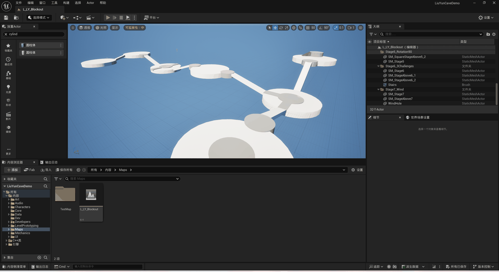

# 开发日志 DevLog

> 规则：每天收工前写一份。三个月后你会忘记自己为什么这么设计，这是唯一的记忆。
>
> **写法要求（给 AI / 给自己）**
> - **一天只写一份**：当天多次收工也合并进同一个日期条目，不再另起「第二轮 / 第四轮」。
> - **精简优先**：一行一件事，只留结论与事实，不写过程叙述；同一件事不重复记。
> - **模板不必每项都写**：没有卡点就省略「卡在哪」；当天已把阶段工作做完、没有明确下一步，就省略「明天第一件事」。
> - 「今天做了」按重要性排序；截图非必填。
> - **AI 读本文件时只看文字，不要读图**：截图是给人看的，读图只会浪费 token，且不影响任务执行。

## 模板（复制粘贴用）

### YYYY-MM-DD

- **今天做了**：（必填，一行一件事，按重要性排序）
- **卡在哪 / 怎么解决**：（有卡点才写）
- **明天第一件事**：（有明确下一步才写，阶段做完可省）
- **截图**：（可选，压到 500 KB 内放进 `Images/`，命名见 `Images/README.md`）

---

## 记录

### 2026-09-26

- **今天做了**：企划案 v0.1 → v0.2（20 章），整合为 `Docs/企划案/` 00～12，去重 + 补验收标准/常见坑。
- **重大决策**：删战斗；删滑翔（风场改为气流电梯）；关卡方向由「洞穴」改为「青碧虚空浮空遗迹」；角色用 VRoid 原创，不用官方模型。
- **卡在哪 / 怎么解决**：`BaseEngine.ini` 迁移 DDC **实测无效**——UE 5.5 由 Zen 层决定路径，必须设环境变量 `UE-LocalDataCachePath` / `UE-SharedDataCachePath`（已写进 `06` 的 6.7）。
- **明天第一件事**：重启引擎，确认 `E:\UE_DDC\Local\Zen` 开始增长后，删 C 盘旧 `Zen\Data`（**别删同级的 `Zen\Install`**）。

### 2026-09-27

- **今天做了**：`M0 环境地基` ✅（工程结构核对、git 初始化、首次编译打包通过）；`M1 玩家手感` ✅（Content 扁平化、玩家改为 C++ 基类 `ALY_PlayerCharacter` + 蓝图、手感参数集中到蓝图 `LY|Player`；tag `M1`，commit `e2d9074`）。
- **定稿**：机关交互 1 `A1+B2` / 2 `A2+B1` / 4 `A1+B1` / 5 `B1` / 6 `A1+B1`，新增复用件 `ALY_Seal`（无碰撞）；关卡以手绘 `Docs/关卡设计草图.png` 为唯一拓扑依据，交互件按真人尺度重做（火方碑总高 ≈220）；转盘左 −90° / 右 +90°；风场双向通行（⑧→⑦ 自由落体）；累计 4 箱开风场。
- **关键判断**：视觉与碰撞分离（碰撞留蓝图根组件，换网格不动动线）；白盒期不做背景，天空球 + 雾 + 远景剪影留到 M9。
- **截图**：本轮定稿用的 11 节点手绘草图（拓扑真值，企划案 `02` 的 2.1 也引用这张）。

  

- **明天第一件事**：建 `Content/Maps/L_LY_Blockout`（Empty Level，关 World Partition）→ Kill Z `-2000` + World Bounds Checks → 放 PlayerStart（①号石厅一端，Z 高于地面 100～200 uu）→ 基础光照（Directional Light + SkyLight + SkyAtmosphere）→ 搭 ① 石厅与 ② 火方碑岛白盒。

### 2026-09-28

- **今天做了**：M2开始，建level，设置+打光+白盒搭建大部分底座和连接
- **截图**：
- **明天第一件事**：白盒摆完底座，开始做机关占位
