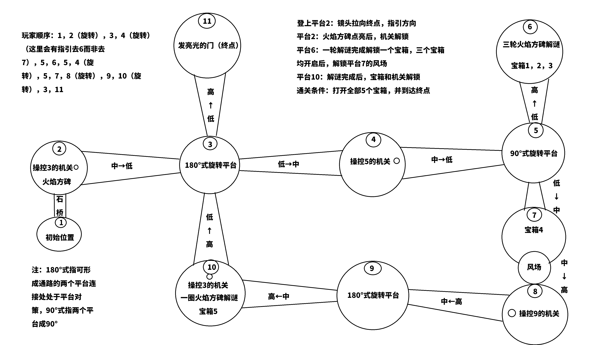

# 留云借风洞天 · UE5 复刻 Demo

用 **Unreal Engine 5.5（C++ + 蓝图混合开发）** 复刻《原神》璃月魔神任务第一章第一幕秘境「留云借风洞天」的**关卡结构与机关玩法**，
做成一款 **10～20 分钟可通关的单人解谜垂直切片**——无战斗、无滑翔、无养成。

个人作品，用于学习与求职展示（Gameplay 程序 / 关卡策划方向）。

**当前进度**：`M1 玩家手感定稿` ✅ ｜ `M2 白盒关卡` 🚧

---

## 玩什么（30 秒看懂）

- **场景**：悬浮在青碧虚空中的空中遗迹——11 个浮空节点，靠石桥与金色光桥连成一条主环路（不是洞穴）
- **核心机制**：**旋转转盘 ×3**（③⑤⑨ 三座盘，全程 5 次旋转，把光桥一段段接出来）、**火方碑谜题 ×2**（⑥号岛「记忆顺序」三轮递增、⑩号岛「联动翻转」环形解谜）、**风场气流电梯**（把玩家从低处平台托举到高处，替代原版滑翔）
- **流程结构**：8 个流程阶段、11 个节点，沿途 **5 个宝箱**
- **通关条件**：打开全部 5 个宝箱并抵达终点庭院




> 上图为手绘关卡草图：11 个节点拓扑 + 每段桥的高差 + 玩家走位顺序。

## 技术亮点

| 分工 | 内容 |
| --- | --- |
| **C++** | 玩家角色与手感参数、交互系统（接口 + 组件）、机关基类与状态机、谜题算法、关卡流程总控 |
| **蓝图** | 机关表现层（材质 / 特效 / 音效）、UI 与交互提示、演出与镜头 |

- **架构**：接口 + 基类 + 事件广播，机关与表现件都可复用、可配置
  - 例：`ALY_Seal`（透明封印罩）被「宝箱」与「火方碑」两个系统共用，靠无碰撞 + 事件驱动实现
- **数据与逻辑分离**：手感参数集中在蓝图的 `LY|Player` 分类（移动 / 跳跃 / 空中控制 / 相机臂长），调参不用重编译
- **版本控制**：Git + Git LFS（UE 二进制资产走 LFS），每个里程碑打 tag，可回溯到任一阶段

## 我负责的部分

- **个人项目，全部由我完成**：策划与文档、关卡设计、白盒搭建、C++ 系统、蓝图表现层、地编组装、测试与优化
- **美术与音频**：AI 生成 / CC0 / 免费商用素材（**未使用任何《原神》提取资产**），逐项登记在素材台账

## 项目结构

```text
LiuYun/
├── LiuYunCaveDemo/             # UE 5.5 工程（源码 + 全部资产）
└── Docs/                       # 设计文档与开发记录
    ├── AI_START_HERE.md       # ⭐ 新对话/新 AI 第一份读这个（进度快照 + 按需查表）
    ├── 企划案/                 # 00～12 完整企划案（考据 / 规格 / 架构 / 管线）
    ├── Images/                 # 开发进度截图
    ├── Progress/               # 里程碑进度看板
    ├── DevLog.md               # 开发日志
    └── AssetCredits.md         # 素材授权台账
```

## 素材与授权

- 本项目**未使用任何从《原神》客户端提取的模型、贴图或音频**
- 所有素材来源与授权明细见 [`AssetCredits.md`](AssetCredits.md)
- 本项目为个人学习 / 作品集用途的**非商业同人作品**，与米哈游（miHoYo / HoYoverse）无关联，未获其官方赞助或认可

## 开发历程

里程碑：`M0 环境地基` → `M1 玩家手感` → `M2 白盒关卡` → `M3 交互系统` → `M4～M7 机关与谜题` → `M8 全流程组装` → `M9 美术替换` → `M10 UI / 音频` → `M11 测试打包`。

- [`DevLog.md`](DevLog.md) — 开发日志，含每天的决策与踩坑记录
- [`Progress/PROGRESS.md`](Progress/PROGRESS.md) — 里程碑进度看板
- [`Images/`](Images/) — 各里程碑截图，随开发更新

<details>
<summary>企划案分册索引（点开）</summary>

| # | 文档 | 回答什么问题 |
| --- | --- | --- |
| 00 | [目录与阅读指南](企划案/00_目录与阅读指南.md) | 按进度决定该读哪篇 |
| 01 | [项目定位与版权合规](企划案/01_项目定位与版权合规.md) | 做什么、不做什么、版权红线 |
| 02 | [关卡考据与设计](企划案/02_关卡考据与设计.md) | 原版流程、11 节点拓扑、尺寸规格 |
| 03 | [机关设计规格](企划案/03_机关设计规格.md) | 各机关逐个的交互与验收标准 |
| 04 | [蓝图与 C++ 协作](企划案/04_蓝图与C++协作.md) | 谁写逻辑、文件夹结构、核心代码 |
| 05 | [美术与资产管线](企划案/05_美术与资产管线.md) | 色板、AI 建模工作流、素材渠道、角色方案 |
| 06 | [环境搭建实操](企划案/06_环境搭建实操.md) | C 盘 / DDC / 编译器 / Git / 显卡配置 |
| 07 | [关卡搭建与地编实操](企划案/07_关卡搭建与地编实操.md) | 白盒怎么搭、光照怎么做、地编效率 |
| 08 | [开发里程碑与打卡](企划案/08_开发里程碑与打卡.md) | M0～M11 逐周任务与验收 |
| 09 | [风险与踩坑速查](企划案/09_风险与踩坑速查.md) | 卡住了怎么办 |
| 10 | [工作法与 DevLog](企划案/10_工作法与DevLog.md) | 每天怎么推进与记录 |
| 11 | [作品集与面试](企划案/11_作品集与面试.md) | 演示视频、技术文档、面试话术 |
| 12 | [附录与参考](企划案/12_附录与参考.md) | 路径、命令、编号对照 |

</details>
